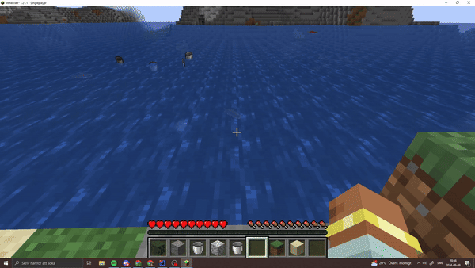

# Bucket pick up

This mod lets you use the pick block feature on fluids to get your bucket from your inventory.

## How to use
1. Have a bucket or be in creative
2. You look at a fluid (water or lava)
3. hold down shift and pres the pick block button.
4. Now it will automatically select your bucket from your inventory

# Looking for a server?
Get BisectHosting and save 25% off for new customers using code Lukas at checkout.
Thanks for your support — it helps me develop this and other mods I make!
#ad
